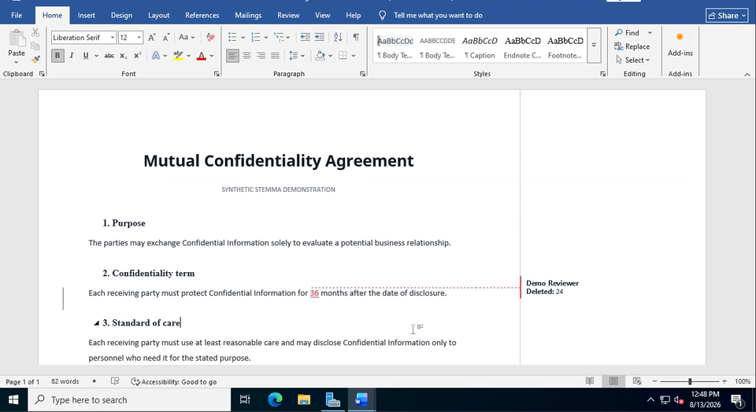

# Stemma

<p align="center">
  <a href="https://github.com/stemma-sh/stemma/actions/workflows/ci.yml?query=branch%3Amain"></a>
  <a href="https://crates.io/crates/stemma-cli"></a>
  <a href="https://www.npmjs.com/package/@stemma-sh/mcp"></a>
  <a href="LICENSE-MIT"></a>
</p>

**Safe tracked changes for Word automation.**

Stemma edits existing Word documents using native tracked changes. Give it a
`.docx` and the changes you want; it creates a new redline that reviewers
accept or reject in Microsoft Word. The original is preserved, and ambiguous
changes are refused instead of guessed.

[](https://stemma.sh/stemma-word-redline.mp4)

*[Watch the 19-second capture](https://stemma.sh/stemma-word-redline.mp4): inspect the
worklist and Stemma creating and validating the redline, then see the generated
DOCX in Microsoft Word with the change attributed to Demo Reviewer.*

[Try the synthetic tracked-change demo](demo/README.md) to inspect the source,
exact instruction, expected redline, and accept/reject results.

Use it to:

- turn a returned draft into one clean, attributed redline (contracts,
  policies, any negotiated document);
- let an AI assistant propose edits that your reviewers accept or reject in
  Word, not in a chat window;
- fill an existing `.docx` template into a finished document: text, tables,
  and content controls, edited in place, with tracked changes or silently
  (direct mode);
- apply the same approved wording change across many documents, with a
  per-file receipt.

Stemma does not upload documents to a Stemma-operated service. In the
path-based workflow, parsing and file writes happen locally. When used through
MCP, the MCP client or its configured model provider may receive selected
document content through tool calls; consult the client's data policy.

[Documentation](https://stemma.sh/docs) ·
[CLI reference](https://stemma.sh/docs/reference/cli) ·
[MCP setup](stemma-mcp/README.md) ·
[Benchmarks](https://stemma.sh/docs/benchmarks) ·
[Changelog](CHANGELOG.md)

## Quick start: with an AI assistant

The Stemma MCP server ships prebuilt binaries for Linux, macOS, and Windows;
`npx` fetches the right one, so there is nothing to build. Choose the narrowest
directory containing the documents and media the agent needs, then add Stemma
to the current project with:

```bash
claude mcp add --scope local stemma \
  -e STEMMA_MCP_WORKSPACE_ROOT=/absolute/path/to/documents \
  -- npx -y @stemma-sh/mcp
```

Then ask for the edit in plain language, for example: *"Open nda.docx and
extend the confidentiality term from 2 to 3 years as a tracked change, then
save it as nda-redline.docx."* The agent opens, inspects, edits, verifies,
and saves; the result opens in Word as an ordinary redline, attributed to the
author you chose, ready to accept or reject.

The `local` scope keeps this registration private to you in the current
project. The workspace root confines the server's file reads and writes; it is
an application boundary, not an OS sandbox. The MCP client or model provider
may receive document content returned by tool calls. See
[MCP setup and configuration for other clients](stemma-mcp/README.md) and the
[security boundary](SECURITY.md#scope).

## Quick start: command line

The CLI installs from source via the Rust toolchain:

```bash
cargo install stemma-cli
```

### Compare two versions

If you have an original and a revised document, turn their differences into
native tracked changes:

```bash
stemma compare as-sent.docx as-returned.docx \
  -o changed.docx \
  --author "Approved Reviewer"
```

Stemma creates `changed.docx` and reports the result:

```text
wrote redline to changed.docx (<n> tracked revisions); bytes=<n> sha256=<hex> collision_policy=create_new disposition=created
```

**Rejecting every change reconstructs `as-sent.docx`. Accepting every change
reconstructs `as-returned.docx`.**

### Apply approved changes

For a controlled worklist, first inspect the exact identity of the document:

```bash
stemma validate agreement.docx
```

The command prints the file's byte count and SHA-256. Put those values into a
short approved worklist:

```json
{
  "schema": "stemma.worklist.v0",
  "input": {
    "sha256": "0123456789abcdef0123456789abcdef0123456789abcdef0123456789abcdef",
    "bytes": 48271
  },
  "author": "Approved Reviewer",
  "changes": [
    {
      "id": "payment-term",
      "old": "Payment is due within 30 days.",
      "new": "Payment is due within 45 days.",
      "expected_matches": 1
    }
  ]
}
```

Save that as `changes.json`, replacing the example hash and byte count with the
values reported for your document. Then create the redline:

```bash
stemma apply agreement.docx \
  --worklist changes.json \
  -o agreement-redline.docx
```

On success, Stemma writes `agreement-redline.docx`, saves a durable receipt at
`agreement-redline.docx.receipt.json`, and returns the same receipt on stdout.
Its decisive fields include:

```json
{
  "status": "complete",
  "deliverable": true,
  "summary": {
    "total": 1,
    "applied": 1,
    "refused": 0
  }
}
```

The complete receipt also records exact artifact hashes and every item outcome,
including diagnoses for refused changes.

`agreement-redline.docx` is a new Word document containing a native tracked
replacement. The original is never overwritten. If the old text is missing,
duplicated, or unsafe to replace, Stemma refuses the worklist instead of
silently choosing a target.

See the [worklist format and complete CLI contract](https://stemma.sh/docs/reference/cli#apply).

## Why Stemma

Word documents are not plain text. They contain revisions, formatting,
comments, tables, fields, notes, and content that must survive an edit.

Common automation approaches either flatten the document or manipulate its XML
directly. Stemma models Word revisions explicitly, including what accepting or
rejecting each change must produce.

- **Reviewable output:** changes appear as native Word revisions.
- **Bounded execution:** stale, missing, or ambiguous instructions are refused.
- **Preservation:** existing revisions and content outside the requested change
  remain part of the document.
- **Verified delivery:** output is validated and written to a new path without
  replacing the source or another existing file.
- **Multi-file evidence:** an MCP task can bind declared replacements and inputs
  before mutation, then emit a manifest that is independently checkable from
  the delivered files. The manifest does not prove undeclared intent.

### Evidence

In our maintainer-run agent benchmark on pinned pre-release v0.1-line builds,
Stemma achieved 95% task success versus 82% for raw-XML editing. The
[full report](https://stemma.sh/docs/benchmarks) documents the version basis,
methodology, failures, corrections, and reproducibility limits. It is evidence
about the agent interface, not a claim of independent validation or current
v0.5 engine correctness.

## Current scope

The focused CLI worklist currently supports explicit old-to-new changes in
top-level body paragraphs. It can guard expected match counts, restrict a
replacement to a block or range, and normalize deliberate whitespace or quote
differences. Unsupported or ambiguous cases are reported rather than guessed.

The engine and MCP server expose broader editing and revision workflows. Stemma
is still pre-1.0, so experimental contracts may change between `0.x` minor
releases with changelog notice.

Stemma is not intended for:

- authoring documents from scratch or from a template language (filling an
  existing `.docx` template by editing it is in scope);
- one-way conversion from DOCX to Markdown or HTML;
- byte-identical XML round trips;
- replacing Word as a general-purpose interactive editor.

See the [fidelity contract](https://stemma.sh/docs/guide/fidelity) and
[stability policy](https://stemma.sh/docs/guide/stability) before building a durable
integration.

## Documentation by goal

- Applying approved changes: [CLI reference](https://stemma.sh/docs/reference/cli)
- Verifying a multi-document delivery: [task-delivery guide](https://stemma.sh/docs/guides/verify-task-delivery)
- Connecting an agent: [MCP setup](stemma-mcp/README.md)
- Embedding the Rust engine: [engine README](stemma-engine/README.md)
- Understanding revisions and fidelity: [guide](https://stemma.sh/docs/guide/concepts)
- Reviewing evidence: [benchmarks](https://stemma.sh/docs/benchmarks)
- Contributing: [contributor guide](CONTRIBUTING.md)

## Development

From a source checkout:

```bash
mise install
just gate
```

The workspace contains the Rust engine, CLI, MCP server, shared artifact
boundary, and a local HTTP/editor demonstration. See the
[architecture map](https://stemma.sh/docs/internals/architecture) for the component layout.

Most of the code was written with AI assistance. Human maintainers provide the
domain model, product direction, review, and release decisions. Validation is
independent of code authorship: the public gate runs formatting and linting,
workspace tests on Linux, macOS, and Windows, the supported Rust-version build,
roughly 1,060 specification-focused conformance tests, documentation checks,
and npm/MCP protocol smoke tests. Release candidates additionally require
exact-artifact qualification, and published benchmark corrections remain in
the report.

[Try the synthetic demo](demo/README.md), then share a
[content-safe first-use report](https://github.com/stemma-sh/stemma/issues/new?template=evaluation_report.yml).

## Contributing

See [CONTRIBUTING.md](CONTRIBUTING.md) for setup and pull request expectations.
Report security issues through [SECURITY.md](SECURITY.md).

## License

Licensed under either [Apache-2.0](LICENSE-APACHE) or [MIT](LICENSE-MIT), at
your option.
